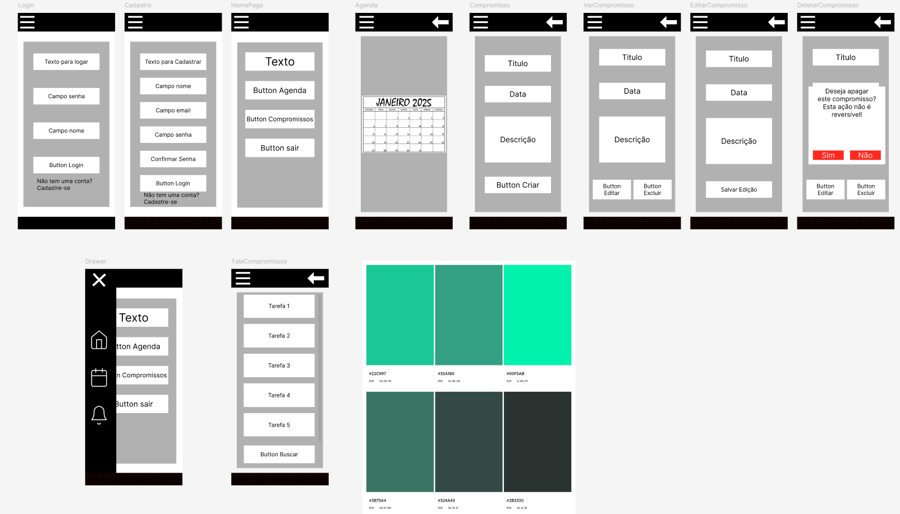
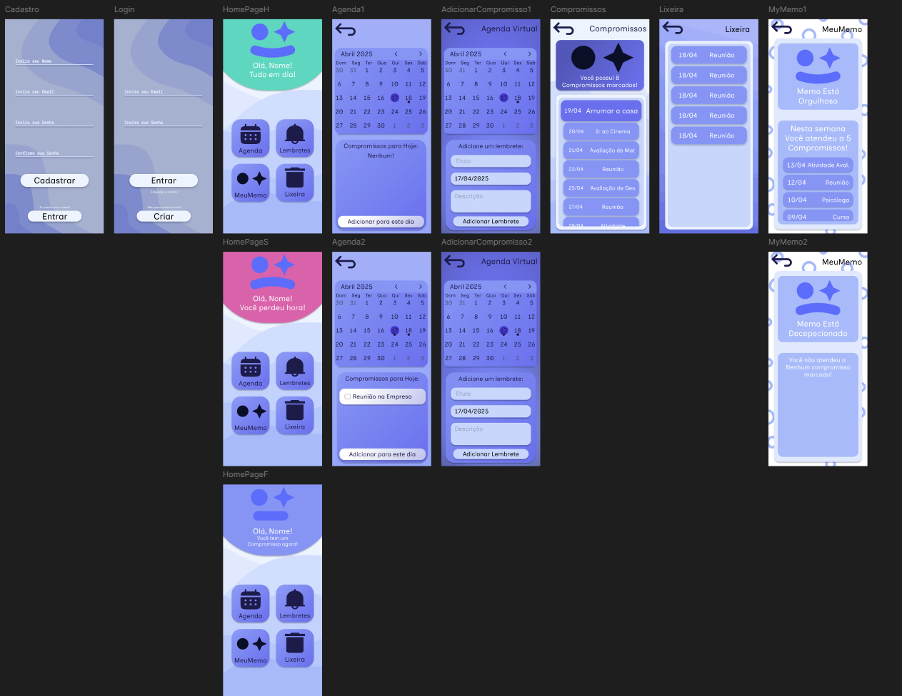

# Design

## Semana 1:

### Objetivo: 
Reestruturar e atualizar o protótipo de um projeto anterior, aplicando paleta de cor, interatividade via protótipo, replanejamento geral de navegação e estrutura.
### Plataforma(s) utilizada(s): 
Figma

### Processos realizados:
 - Pesquisa e estudo sobre teoria das cores e paleta de cores. Criação e implementação de paleta de cores no Figma utilizando a ferramenta <i>styles</i>.
    * Paleta utilizada: Monocromática utilizando 8 tonalidades de azul 
 - <b>Referências Bibliográficas:</b>
https://www.untitledui.com/blog/figma-color-palettes
https://tailwindcss.com/docs/colors

- Pesquisa e estudo sobre interatividade, navegação, estrutura e táticas de design moderno para aplicativos mobile.
    * Uso do Haikai App para criação de backgrounds modernos. https://app.haikei.app/
- <b> Referências Bibliográficas: </b>
  https://dribbble.com/search/app
  https://developer.android.com/design (Guia super útil da google para estudo de UI/UX)

- Entender melhor a ferramenta Figma e como a utilizar de maneira eficiente
  * Boas práticas
  * Estrutura em camadas
  * Nomenclatura de itens
  * Atalhos do teclado
  * Utilização de ferramentas como Frames e Auto-Layout
  * Estudo sobre prototipagem
- <b> Referências Bibliográficas: </b>
https://help.figma.com/hc/en-us/categories/360002051613-Get-started (Guia oficial do Figma, muito útil para tirar dúvidas e aprender mais sobre a ferramenta e design)

- Aplicação do conteúdo aprendido no projeto.

## Aplicativo a ser Reestruturado:
Protótipo do Figma:
https://www.figma.com/proto/jcSCCrljAGuXb4gPRE1WLa/ProjetoAgenda?node-id=0-1&t=yWsLWRZmcEiIlpbd-1

Link do Projeto no Figma:
https://www.figma.com/design/inP9vNEOegu9ia7onhu5ou/15.04.2025?node-id=0-1&t=JxAB9TybhF95wSOg-1

Foto:

## Resultado da Reestruturação:

Protótipo do Figma:
https://www.figma.com/proto/inP9vNEOegu9ia7onhu5ou/15.04.2025?node-id=0-1&t=JxAB9TybhF95wSOg-1

Link do Projeto no Figma:
https://www.figma.com/design/jcSCCrljAGuXb4gPRE1WLa/ProjetoAgenda?node-id=0-1&t=9r4eCrkQZyQjUSdt-1

Foto:

