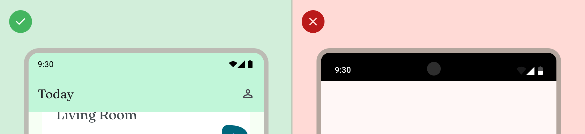
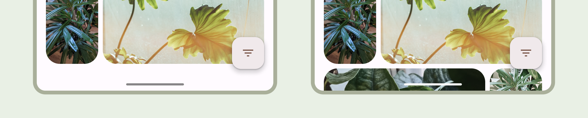

# Fundamentos Material Design Guidelines

## Acessibilidade

- ### Design para Visão

&nbsp;&nbsp;&nbsp;&nbsp;É importante sempre garantir que o conteúdo do aplicativo seja legível, isso é possível ser feito checando o contraste de cores e também o tamanho da fonte, além também de garantir que os componentes sejam visualmente compreensíveis e fáceis de diferenciar um do outro.

- Para trabalhar com tamanho de fonte, o ideal é utilizar ```scalable pixels (sp)```, e não deixando o tamanho da fonte de texto menor que 12sp.

<br>

- O contraste de cor entre o background e o texto deve ser pelo menos de 4.5:1. 

<br>

- Deve-se tomar cuidado com opacidade, visto que ela consegue tornar cores muito mais claras, fazendo com que pessoas míopes ou com problemas de visão tenham dificuldade de enxergar o conteúdo.

<br>

- *Legibility* vs *Readability*, na qual Legibility refere-se o quão fácil é de se ver, e Readability o quão fácil é de endenteder.

<br>

- O Padrão de design para testes de contraste é o WCAG, que é utilizado mundialmente.

<br>

- Em resumo, o contraste de cor é a diferença entre a luminancia do primeiro plano com elementos de fundo, e normalmente é apresentado em um formato de razão. medir o contraste entre o texto em um botão e seu container pode determinar se o texto vai ser legível.

<br>

- Utilização do Material Theme Builder (plugin para o figma) para a criação de temas acessíveis de maneira automatizada.

Figma de estudos sobre checagem de contraste:
https://www.figma.com/design/1gHS8iL6lrH3DcI8h0xahq/Designing-with-accessible-color--Community-?node-id=505-1834&t=wHtHdf0TGD8xGyQ5-1

Checador de Contraste: https://webaim.org/resources/contrastchecker/

- ### Design para Som

&nbsp;&nbsp;&nbsp;&nbsp;TalkBack é um leitor de tela da Google incluído em dispositivos Android capaz de permitir usuários interagir com a tela sem a visualizar, utilizando ferramentas de som para auxiliar na navegação do usuário.

- É fundamental descrever os elementos dentro do código, visto que o TalkBack utiliza propriedades semânticas para narrar.

<br>

- Para satisfazer os requerimentos do Android, descrição textual de icones e imagens devem ser inseridas no código.

<br>

- Descrições de itens decorativos devem ser nulas.

<br>

- Para permitir pular entre blocos de ação e conteúdo, é ideal agrupar elementos de UI ou os granular.

### Design para Habilidades Motoras

&nbsp;&nbsp;&nbsp;&nbsp;O Switch Access permite usuários interagirem com o dispositivo utilizando um ou mais dispositivos externos, o que se tornar útil para usuários com destreza limitada ou dificuldades em interagir com uma tela touch.

- Gestos não devem ser a única maneira de completar ações, ações de acessibilidade devem ser criadas a fim de suportar todos os fluxos do usuário no aplicativo.

<br>

- Alvos de toque, como botões, detectores de gesto, etc. Devem ter pelo menos 48 dp, e pode ultrapassar do UI do elemento.

<br>

- Alertas ou feedback Haptico pode ser utilizado para representar uma ação, como por exemplo uma vibração ou animações.

## Barras do Sistema

&nbsp;&nbsp;&nbsp;&nbsp;A status bar (superior), caption bar e navigation bar (inferior), chamadas de system bars, ou barras do sistema, mostram informações importantes para o usuário, tais como carga da bateria, tempo e notificações. É essencial levar em consideração a presença dessas barras durante o design.

&nbsp;&nbsp;&nbsp;&nbsp;Durante o planejamento, é essencial tratar a área que as system bars ficam como áreas livres, na qual não deve ser colocado nenhum elemento, seja esse elementos de interação, input, displays, etc.

&nbsp;&nbsp;&nbsp;&nbsp;Também é ideal levar em consideração qualquer tipo de interação que o usuário possa ter com o sistema, como gestos, áreas livres da UI, áreas de display, as barras do sistema, e outras capabilidades do dispositivo.

- **Status Bar**

&nbsp;&nbsp;&nbsp;&nbsp;No Android, a barra de status contém ícones de notificações e do sistema, e o usuário interage com ela ao puxar a fim de ativar o drawer de notificações. Os estilos da barra de status podem ser alterados. O ideal é deixar a status bar transparent ou translúcida a fim de permitir o aplicativo cobrir toda a tela do dispositivo, e então, modificar a aparência até que os ícones tenham o contraste correto.

&nbsp;&nbsp;&nbsp;&nbsp;As barras transparentes são ideais para quando a UI não aparece embaixo da barra de status, ou uma imagem por exemplo acaba embaixo da barra de status. Já as barras translúcidas devem ser utilizadas para quando a UI permite rolagem para cima da barra de status.



- **Navigation Bar**

&nbsp;&nbsp;&nbsp;&nbsp;A barra de navegação permite o usuário controlar seu dispositivo por meio de 3 botões: back, home e overview. Os usuários podem escolher entre diversas configurações de barras de navegação, além também de navegações por gesto. Para melhor experiência do usuário, todos os tipos de navegação devem ser levados em conta durante o desenvolvimento.

- Navegação em Gestos

&nbsp;&nbsp;&nbsp;&nbsp;A navegação em gestos não usa botões, e sim, uma barra única que permite a interação dos usuários por meio de arrastar para esquerda, direita, ou para cima, a fim de substituir os botões.

&nbsp;&nbsp;&nbsp;&nbsp;Ela é mais escalável para designing do que a navegação em botões, e para a melhor experiência do usuário, não se deve posicionar nada embaixo da barra de navegação, e também permitir que o conteúdo se expanda de ponta a ponta da tela.

- Navegação em Botões

&nbsp;&nbsp;&nbsp;&nbsp;A Navegação por três botões permite o usuário tocar em botões com funções diferentes para navegar entre o sistema.

- Estilização da Barra de Navegação

&nbsp;&nbsp;&nbsp;&nbsp;O Android cuida da proteção visual da interface do usuário no modo de navegação por gesto e botões. O sistema aplica adaptação de cor dinâmica, na qual o conteúdo e contraste das barras do sistema mudam com base no conteúdo atrás deles.

&nbsp;&nbsp;&nbsp;&nbsp;O Aplicativo também deve permitir EdgeToEdge, a fim de expandir o conteúdo para toda a tela. Assim o sistema desenha a barra de navegação por gesto transparente e aplica adaptação de cor dinâmica.



&nbsp;&nbsp;&nbsp;&nbsp;É recomendado deixar a barra de navegação translúcida, ou também barra transparente quando tem uma bottom app bar ou bottom app navigation bar.

- **Teclado e navegação**

&nbsp;&nbsp;&nbsp;&nbsp;Cada tipo de navegação reage apropriedamente ao teclado na tela, que permite o usuário a performar ações como dispensar o teclado ou mudar o tipo do teclado. Para permitir uma transição suave que sincroniza a transição do aplicativo com o teclado subindo para cima e para baixo.

- **Cutouts de Display**

&nbsp;&nbsp;&nbsp;&nbsp;Os cutouts de display são áreas em dispositivos que extendem à superfície da tela para prover espaço para sensores e câmeras da frente. Eles podem variar dependendo do manufator do dispositivo. É importante considerar os cutouts de display vão interagir com conteúdo, orientação e ponta a ponta.

- **Modo imersivo**

&nbsp;&nbsp;&nbsp;&nbsp;É possível ocultar as barras de sistema quando for necessário uma experiência de tela cheia, como por exemplo quando o usuário está atingindo um filme. O usuário deve ser capaz de tocar na tela para revelar todas as barras, para navegar ou interagir com os contreoles do sistema.

**Referências:**
https://developer.android.com/design/ui/mobile/guides/foundations/system-bars
https://developer.android.com/design/ui/mobile/guides/foundations/accessibility
https://developer.android.com/develop/ui/views/haptics/haptics-principles
