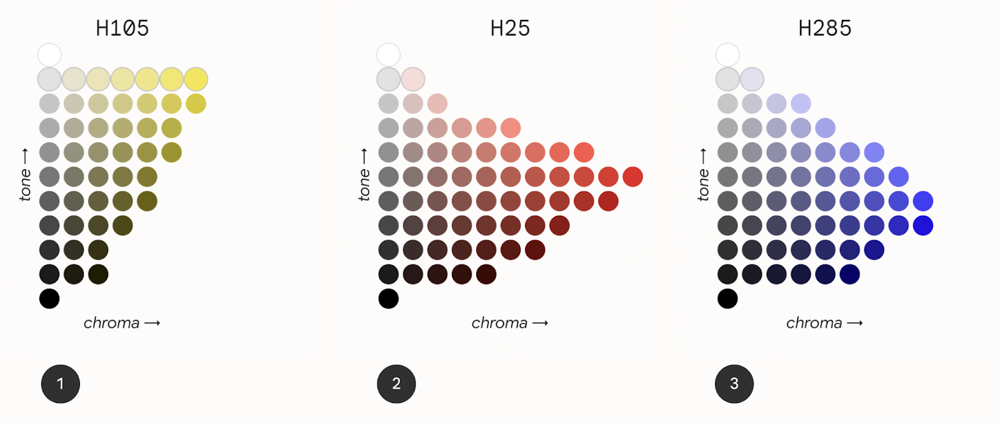
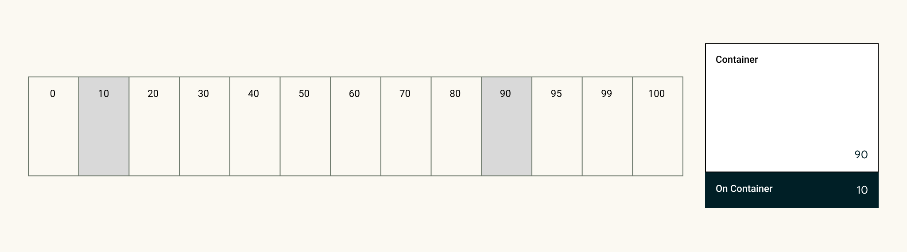

# Styles

## Pontos importantes

- Para garantir acessibilidade:
    * Checar contrastes de cor para garantir a legibilidade.
    *
- Pratique usando cores com sentido: Aplicativos devem sempre se atrelar a uma paleta de cores, extender muito a paleta pode causar confusão nos usuários, além de ser sobrecarregado de informações.

- A paleta de cores devem ter padrões, então é uma prática comum repetir os padrões já estabelecidos.

- É ideal ter um tema escuro e um tema claro, além de um tema de contraste, mesmo que opcional.

- As cores devem indicar o papel de um elemento no sistema.

### Como funciona o display da cor?

&nbsp;&nbsp;&nbsp;&nbsp;Os aplicativos são exibidos em uma tela retroiluminada, que usa cor digital para aderir certos modelos e regras que ajudam os nossos olhos a perceber aquela cor. A cor digital também pode ser chamada de *cor aditivida*, criada ao juntar ou misturar diferentes luzes a fim de criar um espectro completo de cores. A maneira na qual os humanos percebem a cor de uma tela para outra pode variar bastante dependendo da calibração de cor do dispositivo, tipo de tela, configurações, e outros fatores. No início do design de um aplicativo, você deve sempre considerar que as cores podem não ser exatamente as mesmas, também levando em conta as diferentes percepções de cores de cada indivíduo.

### Color Spaces

&nbsp;&nbsp;&nbsp;&nbsp;Um color space é uma organização de cores que utiliza um modelo de cores, como por exemplo o RGB, um modelo de cor aditiva que utiliza o espectro de cores entre vermelho, verde e azul, enquanto outros como CMYK, utilizados para imprimir, são subtrativos. Por conta desse motivo RGB ou modelos aditivos são preferidos.

O M3 introduziu HCT, um color space que utiliza matizes, cromas e tonalidades para definir cores que são perceptivamente precisos comparados a modelos como o HSL.

### Matiz, croma, e tonalidade

&nbsp;&nbsp;&nbsp;&nbsp;O HCT (Hue, Chroma, Tone) permite uma personalização mais flexível, e usos de cores que conseguem ficar conforme os parâmetros do sistema.

A Matiz (Hue) é análoga ao adjetivo que o usuário usa para descrever uma cor, por exemplo "vermelho" ou "verde marinho", o valor HCT das matizes vão de 0 a 360.

O Croma (Chroma) representa a coloridade da cor, indo de cinza neutro até as cores mais vibrantes. Seu valor HCT tem um valor máximo de 120.

A Tonalidade (tone) é a luminância, ou brilho, de uma cor. HCT usa a tonalidade para criar contraste. Cores de mesma tonalidade não podem ser utilizadas para certas acessibilidades. Valores mais baixos geram cores mais escuras, e valores mais altos são mais claras.

## Color System Process

&nbsp;&nbsp;&nbsp;&nbsp;As cores no M3 são construídas a partir do modelo HCT, que entrega esquemas de cor acessíveis e harmoniosos. A paleta é construída a partir de uma única cor fonte, que é traduzida para cinco cores chave: primária, secundária, terciária, neutra, e neutra-variante. Essas cores viram então paletas tonais compostas por incrementos tonais de cada cor.

### Limitações de cores

&nbsp;&nbsp;&nbsp;&nbsp;As limitações de cores representam os limites físicos das cores, sejam essas as próprias limitações biológias do olho humano, ou limitações da cor renderizada na tela. Um exemplo disso são que algumas matizes não podem existir com certos cromas ou tonalidades.



&nbsp;&nbsp;&nbsp;&nbsp;Como pode ser notado na imagem, temos três mapas para os valores de matiz, H105, H25, H285.

&nbsp;&nbsp;&nbsp;&nbsp;Como pode ser notado, a cor amarela possui cromas limitados com certos tons, não possuindo um alcance muito grande de vibrações em tonalidades mais baixas.

&nbsp;&nbsp;&nbsp;&nbsp;Já no segundo item, vemos que a cor vermelha (H25) possui mais opções que a amarela (H105), e o ponto no qual tem a maior quantidade de coloridade (croma) está nos níveis mais baixos.

&nbsp;&nbsp;&nbsp;&nbsp;A cor azul (H285) por sua vez demonstra a maior coloridade dos três, mesmo que esteja em uma tonalidade mais escuro, porém, com uma coloridade menor em tonalidades menores.

### Esquemas de cores

&nbsp;&nbsp;&nbsp;&nbsp;Um esquema de cor (color scheme) são um conjunto de cores de ênfase e superfícies que derivam de um tom específico de tonalidades, sendo associadas a os papéis da cores em uma aplicação. Eles são então mapeados para elementos e componentes de UI, com seus papéis de cores refereindo a sua função ao invés de sua matiz. Um exemplo disso seria o papél da cor ser ```on-primary``` invés de ```on-azul```

&nbsp;&nbsp;&nbsp;&nbsp;Por design, os esquemas de cores tendem a ser harmoniosos, permitir a acessibilidade de textos, e distinguir elementos da UI de superfícies. Os pares de papéis de corres (como por exemplo as cores ```container ``` e ```on-container```, que possuem tonalidades diferentes, que permitem um contraste acessível. )



## Aplicações das cores

&nbsp;&nbsp;&nbsp;&nbsp;A cor da UI consiste de cores accent (ênfase), semantic (semânticas) e surface (superfície).

- Cores accent referem-se a cores essenciais, que são cores utilizadas em elementos da UI que necessitam de ênfase.

- Cores semantic são cores com um propósito específico (por exemplo ```on-primary```)

- Cores surface referem a qualquer cor neutra utilizada para fundos de elementos.

### Cor accent

&nbsp;&nbsp;&nbsp;&nbsp;Cores accent normalmente são as mais expressivas na UI, seja para construir uma marca, destacar elementos de ação, expressão pessoal ou expressão do usuário.

&nbsp;&nbsp;&nbsp;&nbsp;Cada cor accent (primary, secondary e tertiary) ficam em grupos com 4 a 8 cores compatíveis de diferentes tonalidades, criando um esquema de cores.

### Cores dinâmicas

&nbsp;&nbsp;&nbsp;&nbsp;Cores accent podem ser definidas de fontes dinâmicas.

&nbsp;&nbsp;&nbsp;&nbsp;Desde o Android 12, as cores dinâmicas permitem o sistema extrair uma cor fonte do papel de parede o usuário ou de algum conteúdo dentro do app, como um asset. A cor dinâmica utiliza algorítimos de MCU e processos para criar esquemas e os implementar.

### Esquemas estáticos

&nbsp;&nbsp;&nbsp;&nbsp;Um esquema estático é um esquema que tem valores imutáveis. Normalmente, são utilizados para definir cores de marca, aplicando cores accent primary, secondary e tertiary na paleta de cores principais da marca.

&nbsp;&nbsp;&nbsp;&nbsp;É recomendado o uso de esquemas estáticos, visto que nem todos os sistemas podem possuir as cores dinâmicas.

&nbsp;&nbsp;&nbsp;&nbsp;Utilizando o Material Theme Builder, é possível aplicar algorítimos de MCU para gerar um tema estático customizado. Isso resulta em cores escolhidas pelo desenvolvedor, mas que ainda assim são alinhadas com o sistema de cor M3 e seus princípios de acessibilidade.
