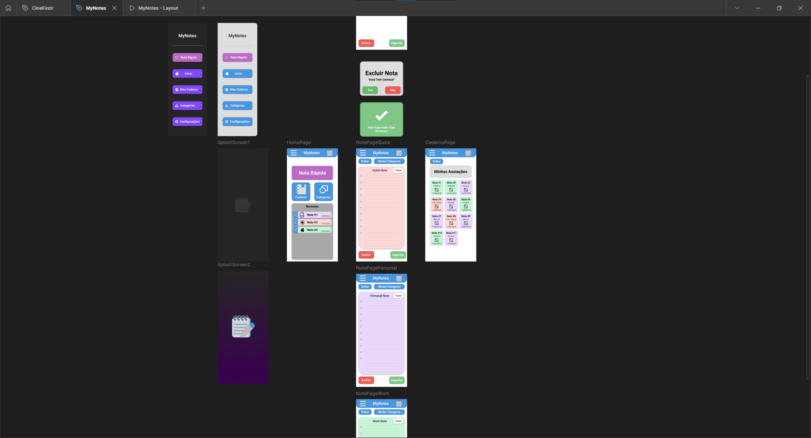
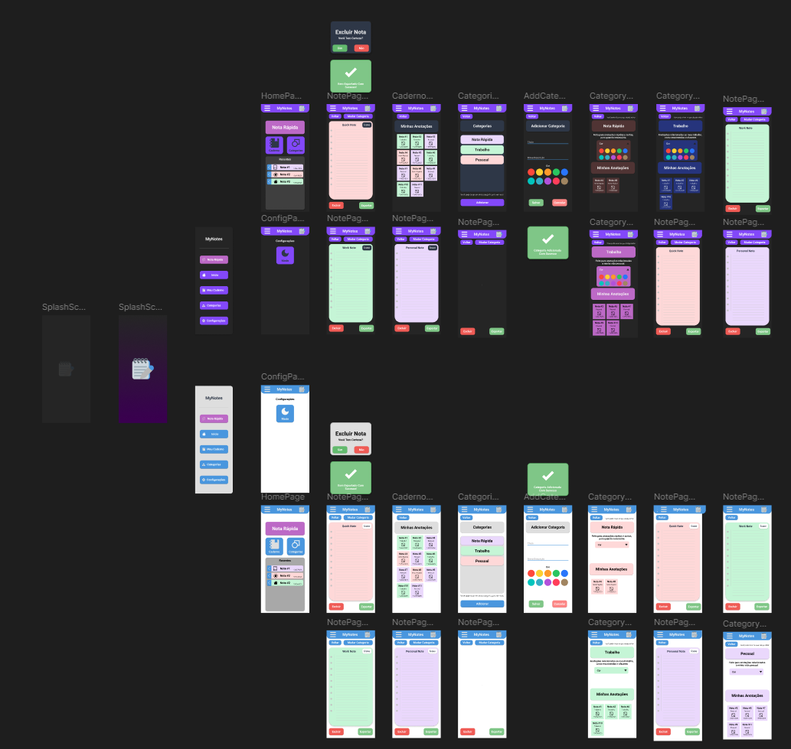

# Dia 1 (13/05/2025)
## Realização de protótipo do figma
Protótipo sobre aplicativo de anotações, a fim de ser utilizado para realização de estudos sobre funcionalidades nativas (shared_preferences & sqflite) e temas (ThemeProvider e ThemeData).

Após a conclusão do protótipo, começar a trabalhar no aplicativo utilizando Flutter.

Progresso: 70%

# Dia 2 (14/05/2025)
## Continuação e finalização do projeto

Progresso: 100%

Protótipo: https://www.figma.com/proto/MMblwGIA4Q9zxtp0vP98Uu/MyNotes?node-id=1-60&t=fhqVopR1pV1ltpV1-1
Design: https://www.figma.com/design/MMblwGIA4Q9zxtp0vP98Uu/MyNotes?node-id=1-60&t=fhqVopR1pV1ltpV1-1

Início do desenvolvimento