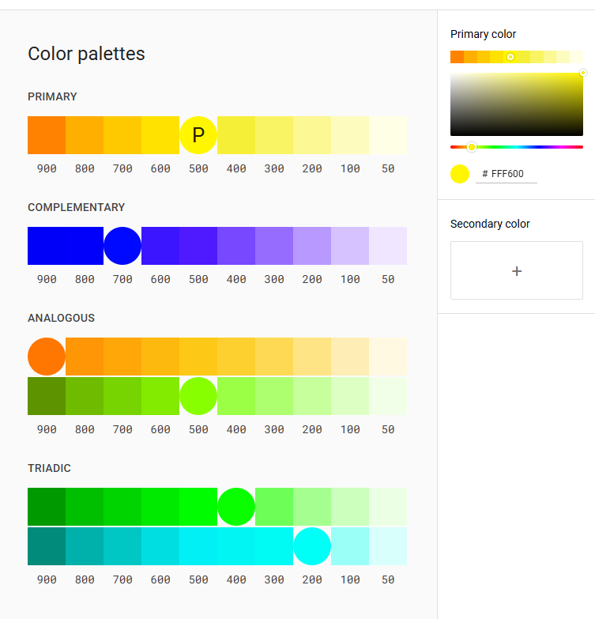
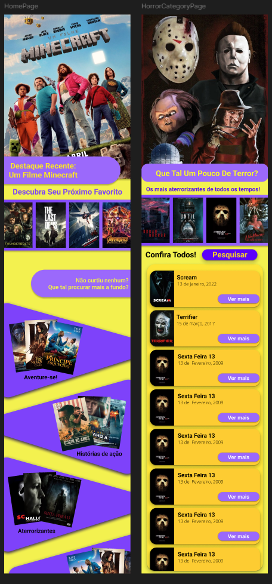

# Semana 3 - Design

## Objetivos:

- Construir uma interface para uma aplicação mobile de lista e catálogo de filmes recentes.
- Aplicar conceitos de paleta de cores, brainstorming e design thinking.
- Realização do projeto posteriormente utilizando o protótipo.

## Progresso:

### Paleta de cores
- Após uma análise mais profunda sobre psicologia das cores, conclui que a melhor paleta a ser utilizada será uma com tonalidade amarela, visto à assossiação a sentimentos de: relaxamento, alegria, felicidade, imaginação, conhecimento e idealismo.

    * Ferramenta utilizada para construção da paleta de cores:
    https://m2.material.io/design/color/the-color-system.html#tools-for-picking-colors

    * Constitui-se de 10 tonalidades de amarelo (primária), roxo (complementar), laranja e verde (análogas) e ciano (tríade).
  
- A cor principal [Amarelo[500]] será utilizada para elementos interativos importantes, como botões, ícones de ações, barras de progresso, etc.
- As tonalidades mais claras de amarelo serão utilizados para fundo de seções e elementos de interface secundários
- As tonalidades mais escuras de amarelo serão utilizados para apontar textos importantes ou para sombreamento
 
- O roxo será utilizado para accents, realizando um contraste forte com a cor primário.

### Design

O sistema de design utilizado no projeto será o Material Design, criado pelo Google.
Esse sistema enfatiza:

- Utilização de sombras e superfície (meio que em camadas)
- Movimento e animações sutis
- Design baseado em materiais (inspirados no mundo físico)
- Consistência de padrões

O apelo também será voltado à questões de imagem e visual moderno, a fim de fazer sucesso para o seu público alvo

### Tipografia

- Para o projeto, serão utilizados alguns estilos do texto, como por exemplo:

    * Titulo: Roboto, Fontsize 24px, Bold, Amarelo[900]
    * Titulo Secundário: Roboto, 18px, Semibold, Amarelo[800]
    * Corpo de Texto: Open Sans, 16px, Regular,  Altura da linha: 1.3
    * Legenda: Open Sans, 14px, Light
    * Botão Principal: Roboto, 16px, Semibold, Roxo[900]
    * Botão Secundário: Roboto, 14px, Regular, Amarelo[900]

## Progresso dia 1:

## Progresso dia 2:

- Protótipo concluído, início do desenvolvimento: 
- Protótipo: https://www.figma.com/proto/wgMvxVDRtuTTXBQnbmymfh/Prot%C3%B3tipo?node-id=0-1&t=BvbWKED8LugUKXgr-1
- Arquivo: https://www.figma.com/design/wgMvxVDRtuTTXBQnbmymfh/Prot%C3%B3tipo?node-id=0-1&t=BvbWKED8LugUKXgr-1