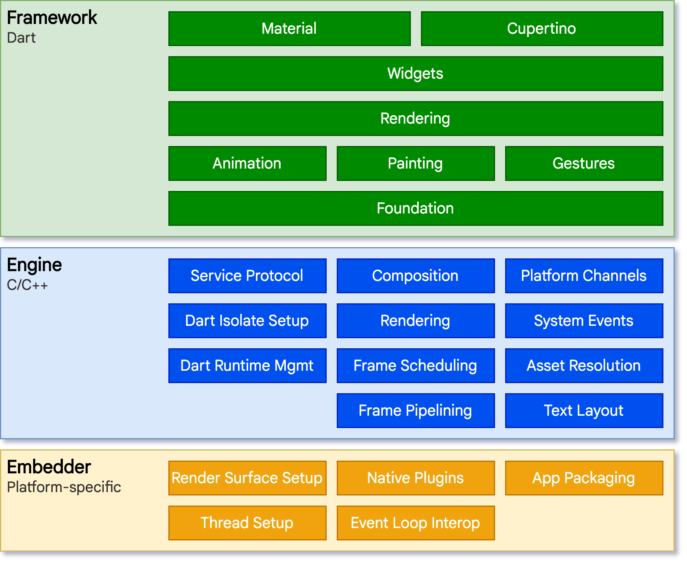
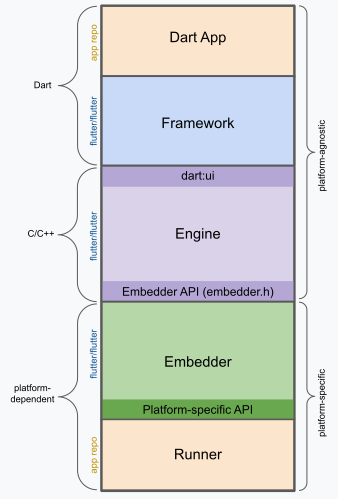

# Estudo geral sobre o Flutter e seu funcionamento

O Flutter é um Framework para programação desenvolvido pela Google que utiliza da linguagem Dart. O principal foco do Flutter é sua capacidade de desenvolvimento multiplataforma em dispositivos móveis.

## Desenvolvimento multiplataforma

O Desenvolvimento multiplataforma faz referência ao desenvolvimento de softwares que podem ser utilizados em diversas plataformas. O Flutter, por ser focado a dispositivos móveis, consegue utilizar o mesmo código para construir várias versões que rodarão em diferentes dispositivos, desde Android e iOS, até Web, Windows e SmartTVs.

A maneira no qual o Flutter realiza esse porte entre multiplos sistemas operacionais é por meio de sua arquitetura e princípios. O Framework roda em uma VM (Virtual Machine) que permite que os apps sejam compilados diretamente para o código da máquina do dispositivo em que está rodando, permitindo o mesmo código funcionar tanto em sistemas Intel X64 ou ARM e até mesmo em JavaScript.

## Estrutura do Flutter

Esta ferramenta pode ser separada em um sistema em camadas, existindo como uma série de bibliotecas separadas que dependem de cada camada inferior. Nenhuma camada possui acesso privilegiado à camada abaixo, e cada parte do framework é feito para ser opcional e substituível.



### Embedder
Na visão do dispositivo, as aplicações Flutter são como qualquer outra aplicação nativa (específica), um <i> Embedder </i> específico para aquela plataforma permite um ponto de entrada, requisitando ao dispositivo acesso à serviços como: Renderização, acessibilidade, entradas, etc. Esse embedder é escrito em uma linguagem apopriada para a plataforma, exemplos: C++ e Java para Android, Swift e Object-C para iOS. E utilizando dessa ferramenta, o código consegue ser integrado como módulo para uma aplicação, ou agindo como a aplicação em si.

### Engine (Motor)
A camada central do Flutter refere-se à sua Engine (Escrita em C++) e permite o suporte necessário a todas as aplicações. Ela é responsável pelo processo de <i>rasterizar</i> (converter um objeto baseado em vetores a um formato raster ou bitmap, basicamente: permitir o display) sempre que necessário. O motor também permite a implementação das APIs centrais do Flutter, tais como: Gráficos, layout de texto, entrada e saída de rede, suporte a acessibilidade, arquitetura de plugin e ferramentas para rodar e compilar o código em Dart.

O motor é exposto ao Framework do Flutter por meio da biblioteca ```dart:ui```, que envolve todo o código do motor em classes Dart. Esse pacote também inclui as classes para input, gráficos e texto.

### Framework
A maneira no qual nós (desenvolvedores) interagem com o flutter é por meio do framework, que inclui uma grande quantidade de ferramentas para construir interfaces em diversos tipos de plataformas. As bibliotecas do framework são compostas por uma série de camadas, funcionando de maneira hierarquica (as bibliotecas de baixo são necessárias para as de cima funcionar).

- Camada de Fundação:
  Possui diversas classes que permitem serviços como animação, pintura de frames (basicamente toda a construção da interface) e gestos (interações com o usuário). 
<br>

- Camada de Renderização:
  Permite abstração para lidar com o layout. Essa camada é a utilizada para construir a árvore de widgets do Flutter (mais sobre os Widgets abaixo). Esses objetos podem ser manipulados de maneira dinâmica, com a árvore automaticamente atualizando com cada mudança.
<br>

- Camada de Widgets:
  A camada de widgets é basicamente a responsável por fazer toda a interface. Cada objeto renderizado na árvore de widgets possui uma classe Dart associada a ela, e essa classe também pode ser chamada de widget. Ela também permite a criação de widgets por parte do desenvolvedor, definindo classes reutilizáveis.
<br>

- Camada Material e Cupertino:
  Basicamente são bibliotecas que envolvem diversos widgets. A diferença entre as duas é a filosofia de design, com o Material seguindo os padrões de design do Android e a Cupertino seguindo os designs do iOS

A camada do Framework não é tão grande, e diversas funcionalidades mais avançadas necessitam de pacotes, como por exemplo serviços http, câmera, GPS, giroscópio, etc.

## Anatomina de um aplicativo Flutter



Basicamente, um aplicativo Flutter é composto por diversas partes, gerados pelo comando ```flutter create```, como já vimos o que o Framework, Engine e Embedder fazem, vamos simplificar as coisas:

- **Dart App**
    Posiciona os widgets na interface
    Permite a lógica de programação
    É a trabalhada durante o desenvolvimento em Flutter
<br>

- **Framework (Dart)**
    Permite uma API construir aplicativos com diversas funcionalidades
    Cria a árvore de widgets
    [Código do Framework (GitHub)](https://github.com/flutter/flutter/tree/main/packages/flutter/lib)
<br>

- **Engine (C++)**
    Responsável por rasterizar (compor) a interface
    Implementação das APIs mais simples (gráfico, texto, compilador Dart, etc).
    É utilizada pelo framework por meio da biblioteca ```dart:ui```
    É implementado em diferentes plataformas por meio do Embedder
    [Código da Engine (GitHub)](https://github.com/flutter/flutter/tree/main/engine/src/flutter/shell/common)
<br>

- **Embedder (Depende do Sistema)**
    Permite o Flutter rodar em múltiplas plataformas
    Empacota o código em Dart de maneira que o sistema operacional possa entender
    É escrito na linguagem que o sistema operacional trabalha
    [Código do Embedder (GitHub)](https://github.com/flutter/flutter/tree/main/engine/src/flutter/shell/platform)
<br>

- **Runner**
    Compila o Embedder em um app que possa rodar no sistema operacional do dispositivo
    Gerado pelo ```flutter create```

## Widgets
  A composição e estruturação dos elementos em Flutter é realizada por meio dos widgets, os widgets formam uma hierarquia baseada em sua composição, com cada um deles possuindo um elemento pai, que podem receber o seu contexto. Normalmente o widget raiz que engloba todo o aplicativo é o MaterialApp ou CupertinoApp.

  Os widgets utilizados para a construção de UI são compostos por diversos widgets simples que servem apenas uma única função, o widget `Container` por exemplo é composto por outros widgets, esses sendo: `LimitedBox`, `ConstrainedBox`, `Align`, `Padding`, `DecoratedBox` e `Transform`.

  Os widgets são construídos a partir do método `build()`, que também serve para reconstruir o widget toda vez que o método foi chamado. Toda vez que o estado de um widget é alterado, esse método é chamado para reconstruir toda a UI baseada no estado novo, feito pelo método `setState()`, que 'diz' ao Flutter que o estado foi alterado, e então o Framework reconstrói o widget a fim de replicar as novas mudanças do estado.

## Estados de Widgets

  O Flutter possui duas classes principais de widget, stateful e stateless.

  Aos widgets que não possuem um estado mutável, ou seja, que é capaz de ser alterado ou possui propriedades de mudança ao longo do tempo (exemplo: Icon, Label) é atribuída a superclasse `StatelessWidget`, caso contrário, será um `StatefulWidget`. Esses widgets Stateful são capazes de armazenar o estado em uma classe filha de `State`, e não possuem um método `build()`, pois constroem sua interface por meio do objeto `State`.

  Por conta disso, toda vez que o estado é alterado, é necessário chamar o método `setState()`, caso contrário o framework não irá notar ou construir o widget com as alterações.

  